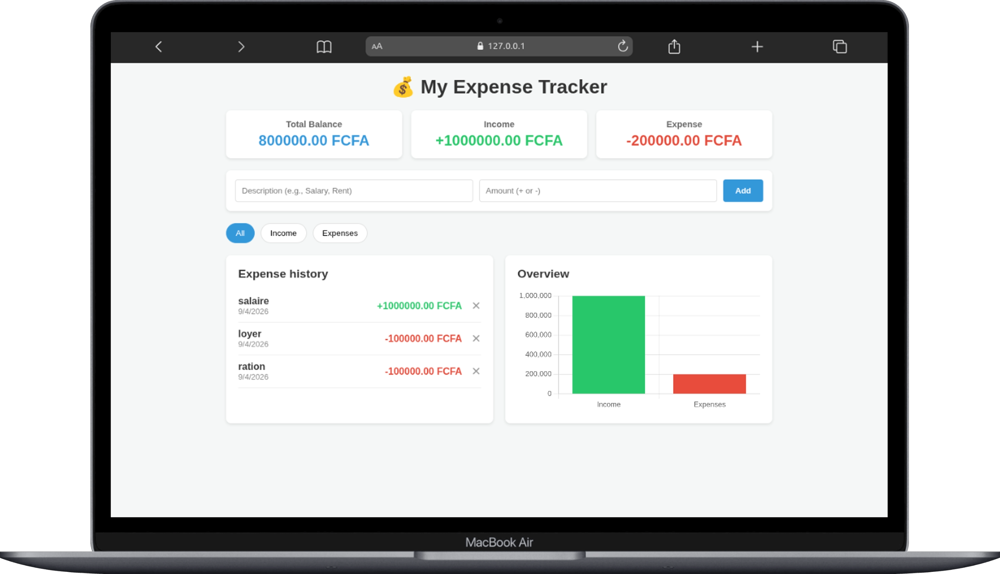
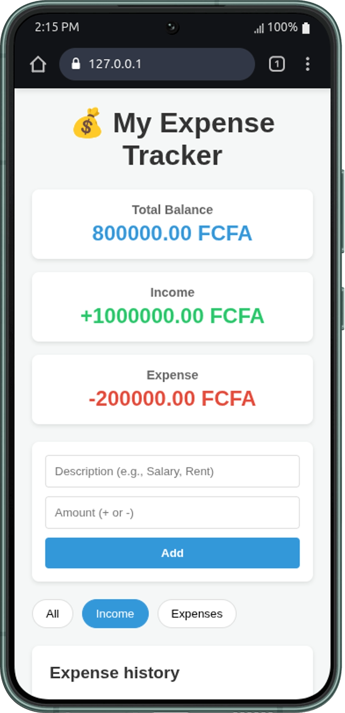

# 💰 Expense Tracker JavaScript Personal Finance Application

A fully functional personal finance application built with JavaScript, HTML, and CSS. Users can add, track, and visualize their income and expenses, with data persistence using Local Storage and dynamic data visualization using Chart.js

---

## 🎯 Project Goals

This project aims to:

- Implement Local Storage
- Integrate a library (Chart.js)
- Build a responsive
- Handle mathematical operations and data aggregation efficiently using array methods

---

## 🚀 Key Features

### ➕ Add Transactions

- Users enter a description and an amount
- The app automatically categorizes the transaction: positive amounts are "Income", negative amounts are "Expense"
- Instantly updates the interface and saves to Local Storage

### 📊 Real-time Summary

- Displays Total Balance, Total Income, and Total Expense
- Amounts are formatted to 2 decimal places in **FCFA**
- Dynamic color coding (Green for income, Red for expenses, Blue for balance)

### 🔍 Filtering System

- Filter the transaction history by: **All**, **Income**, or **Expenses**
- Active filter state is visually highlighted
- List updates instantly

### 📈 Data Visualization (Chart.js)

- Displays a dynamic **Bar Chart** comparing total Income vs. Expenses
- Chart automatically destroy and re-renders
- Responsive and animated for a smooth user experience

### 💾 Local Storage

- All transactions are saved in the browser's Local Storage
- Data is automatically loaded on page refresh

### 🗑️ Delete Transactions

- Each transaction has a delete button (✕)
- Removes the item from the array, updates Local Storage, and refreshes instantly

---

## 🛠️ Tech Stack

### Languages

- HTML5
- CSS3
- JavaScript

### Libraries

- [Chart.js](https://www.chartjs.org/) (for data visualization)
- Loaded via CDN in `index.html` to render the 2D bar chart context (`getContext('2d')`).

---

## 📐 Responsive Breakpoints

| Breakpoint | Target Device |
| :--- | :--- |
| ≤ 820px | Mobile phones & some Tablets |
| ≥ 820px | Desktops |

---

## 📷 Page Preview

### Desktop View



### Mobile View

| Mobile View 1 | Mobile View 2 |
|:-------------:|:-------------:|
|  | .png) |

---

## 📂 Project Structure

```text
expense_tracker/
├── assets
│   └── images
│       ├── Galaxy-S22-127.0.0.1 (1).png
│       ├── Galaxy-S22-127.0.0.1.png
│       └── Macbook-Air-127.0.0.1.png
├── index.html
├── README.md
├── script.js
└── style.css
```

---

## 🚀 Getting Started

**Clone the repository:**

```bash
git clone https://github.com/mike2377/expenses_tracker.git
cd expenses_tracker
```

**Run application:**

- Simply open `index.html` in web browser
- Or use a live server extension in VS Code for a better development experience

---

## 🧠 Challenges Faced

- **Chart.js Re-rendering Bug:** Initially, updating the chart caused a "canvas already in use" error. I solved this by checking if `myChart` exists and calling `myChart.destroy()` before creating a new chart instance.
- **State Synchronization:** Ensuring that the Summary, List, and Chart always reflect the exact same data. I solved this by creating a single `updateUI()` master function that calls all three render functions sequentially after any data change.
- **Input Logic:** Automatically determining if a transaction is an income or expense based on the mathematical sign of the input (`amount >= 0 ? 'income' : 'expense'`), while storing the amount as an absolute value for consistent calculations.

---

## 📚 What I Learned

- Mastering `localStorage` for CRUD operations in JS
- Integrating and configuring libraries like Chart.js
- Using advanced array methods (`filter`, `reduce`) for efficient data aggregation and summation

---

## 👨🏽‍💻 Author

**Kembou Keumoe Ivan Michael**  
Junior Fullstack Developer

📩 Email: [kman39457@email.com](mailto:kman39457@email.com)  
🌍 Based in Cameroon | Open to remote opportunities
